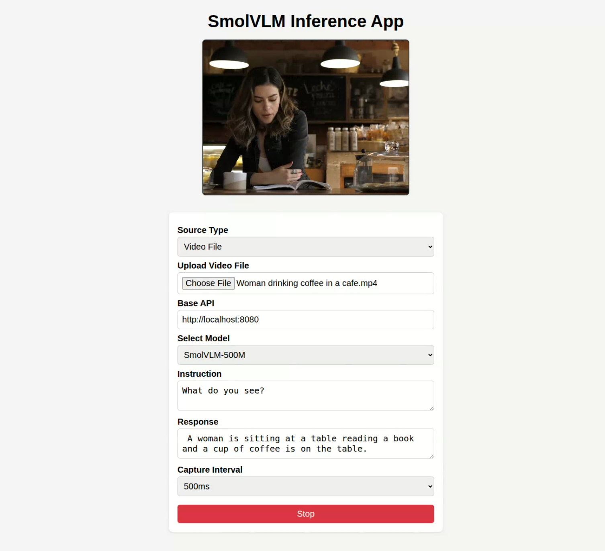
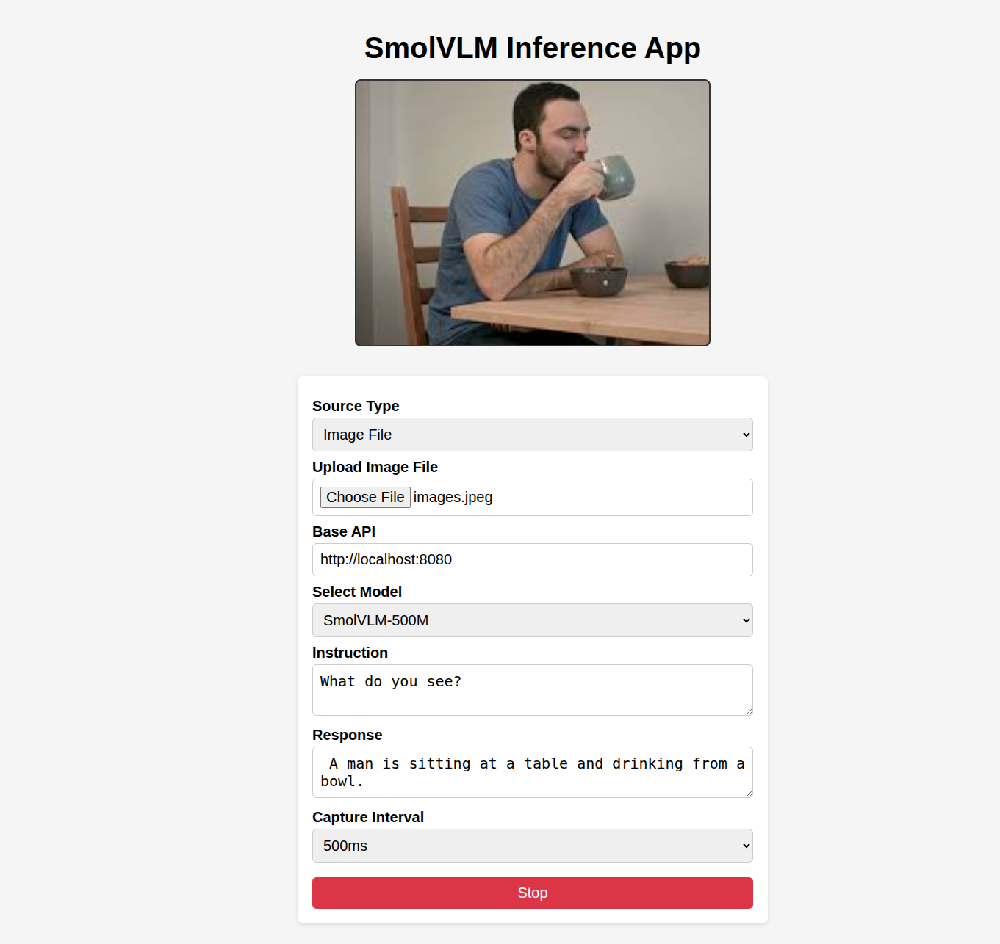

# 🦙 SmolVLM Realtime Inference UI

A lightweight, blazing-fast visual interface for **SmolVLM** models —  
run real-time vision inference from your **webcam**, **video files**, or **images**, right in your browser.


## 🖼️ Interface Preview

| Webcam Input        | Video File         | Image Upload        |
| ------------------- | ------------------ | ------------------- |
|  |  |  |


---

## 🚀 Features

#### - 📸 Webcam, 📹 Video File, 🖼️ Image Upload support
#### - 🔄 Easy model switching (SmolVLM / SmolVLM2)
#### - ⚡ Lightweight UI — pure HTML + JS
#### - 🧠 Powered by `llama.cpp` + GGUF models
#### - ✅ Offline & local-server ready

---

## ⚙️ Setup (First Time Only)

```bash
git clone https://github.com/Shohruh72/SmolVLM-UI.git
cd SmolVLM-UI
chmod +x setup.sh run_server.sh
./setup.sh   # builds and selects your model
```
## ▶️ Inference (Anytime After)
```bash
./run_server.sh   # no rebuild, just launch
```
## Open the UI
Then open index.html in your browser and start prompting!

> 💡 **Tip:** After you’ve run `./setup.sh` once, you only need to use `./run_server.sh` on subsequent runs.

## 📦 Supported Models
```
* ggml-org/SmolVLM-Instruct-GGUF
* ggml-org/SmolVLM-256M-Instruct-GGUF
* ggml-org/SmolVLM-500M-Instruct-GGUF
* ggml-org/SmolVLM2-2.2B-Instruct-GGUF
* ggml-org/SmolVLM2-256M-Video-Instruct-GGUF
* ggml-org/SmolVLM2-500M-Video-Instruct-GGUF
```

## Reference

- Inspired by [http://github.com/ngxson/smolvlm-realtime-webcam](http://github.com/ngxson/smolvlm-realtime-webcam) repository.


